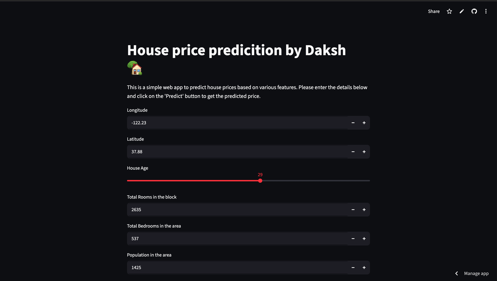

# House Price Prediction

This is a simple Machine Learning project to predict house prices.

## Technologies Used

* Python
* Pandas
* NumPy
* Scikit-learn
* Streamlit

## Installation

```bash
pip install -r requirements.txt
```

## Run the Project

```bash
streamlit run app.py
```

## About

I made this project to learn Machine Learning and Streamlit. It takes house details as input and predicts the house price.

#Live Demo
house-price-prediction-by-daksh.streamlit.app
# Project Screenshot 
## Screenshot

